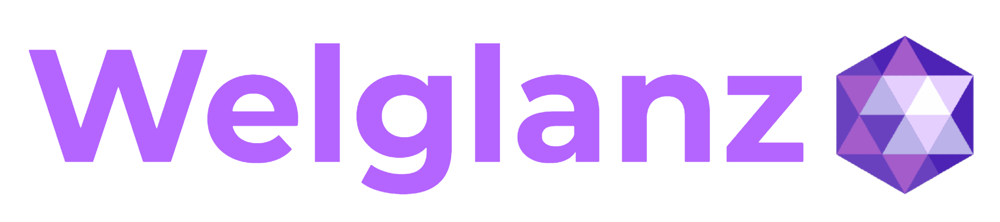
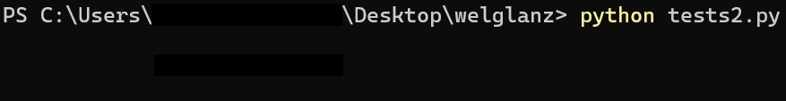

<p align="center"></p>

Foundation for future development.



<b>

```python
def target(smanager, wgzdata):
    for n in range(99999999):
        wgzdata.data = n

        if smanager.stop_required:
            break

wgz_spinner('Loading: $wgzdata/99999999', 'Loading Finished.', 'Canceled!', target, WGZ_SPINNER_ICON_FALLING_SAND)
```

```python
wgz_multiselect(
    (
        WgzSelectable('Apples', 'apples', 'No hint, just apples.'),
        WgzSelectable('Bananas', 'bananas', 'Yellow!'),
        WgzSelectable('Strawberries', 'strawberries', 'Literally no hint incoming below!'),
        WgzSelectable('Nothing', 'nothing')
    ), focus_id='bananas'
)
```

</b>


<sub>Alpha Testing; Subject to change.</sub>

<sub>The first complete version is expected to be released between October and December of 2025. I'm not really working on the project.</sub>
